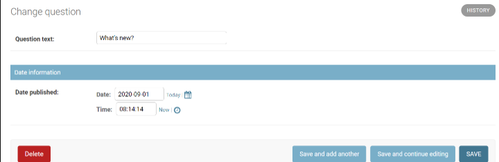

# django入门进阶01学习笔记01
学习笔记,第一个Django应用

## Part 1：请求与响应

django-admin startproject mysite

一个新建立的项目结构大概如下：

```
mysite/  
    manage.py  
    mysite/  
        __init__.py  
        settings.py  
        urls.py  
        asgi.py  
        wsgi.py  
```
python manage.py startapp polls


系统会自动生成 polls应用的目录，其结构如下：

```
polls/  
    __init__.py  
    admin.py  
    apps.py  
    migrations/  
        __init__.py  
    models.py  
    tests.py  
    views.py  
```
polls/views.py文件中，编写代码：

```
from django.http import HttpResponse  
  
def index(request):  
    return HttpResponse("这里是liujiangblog.com的投票站点")  
```
urls.py（不要换成别的名字），在其中输入代码如下：

```
from django.urls import path  
  
from . import views  
  
urlpatterns = [  
    path('', views.index, name='index'),  
]  
```
此时，目录的文件结构是这样的：

```
polls/  
    __init__.py  
    admin.py  
    apps.py  
    migrations/  
        __init__.py  
    models.py  
    tests.py  
    urls.py  
    views.py  
```


mysite/urls.py文件，代码如下：

```
from django.contrib import admin  
from django.urls import include, path  
  
urlpatterns = [  
    path('polls/', include('polls.urls')),  
    path('admin/', admin.site.urls),  
]  
```


## Part 2：模型与后台

polls/models.py

```
from django.db import models  
  
  
class Question(models.Model):  
    question_text = models.CharField(max_length=200)  
    pub_date = models.DateTimeField('date published')  
  
  
class Choice(models.Model):  
    question = models.ForeignKey(Question, on_delete=models.CASCADE)  
    choice_text = models.CharField(max_length=200)  
    votes = models.IntegerField(default=0)  
```


INSTALLED_APPS中，将该路径添加进去（字符串格式）


python manage.py makemigrations polls

python manage.py sqlmigrate polls 0001#展示SQL语句

python manage.py check#检查项目中的错误，并不实际进行迁移或者链接数据库的操作。

python manage.py migrate#运行migrate命令，在数据库中进行真正的表操作了。


进入Python的shell，请输入命令：

python manage.py shell

相比较直接输入“python”命令的方式进入Python环境，调用manage.py参数能将DJANGO_SETTINGS_MODULE环境变量导入，它将自动按照mysite/settings.py中的设置，配置好你的python shell环境，这样，你就可以导入和调用任何你项目内的模块了。


或者你也可以这样，先进入一个纯净的python环境，然后启动Django，具体如下：

```
>>> import django  
>>> django.setup()  
```
尝试下面的API吧

```
>>> from polls.models import Question, Choice # 导入我们写的模型类  
  
# 现在系统内还没有questions对象  
>>> Question.objects.all()  
```
## Part 3：视图和模板

get_object_or_404()方法将一个Django模型作为第一个位置参数，后面可以跟上任意数量的关键字参数，如果对象不存在则弹出Http404错误。

get_list_or_404()方法，和上面的get_object_or_404()类似，只不过是用来替代filter()函数


删除模板中硬编码的URLs

```html
<li><a href="">{{ question.question_text }}</a></li>

```
Django会在polls.urls文件中查找name='detail'的路由，具体的就是下面这行：  
```html
path('<int:question_id>/', views.detail, name='detail'),  
```

让我们将代码修改得更严谨一点，将polls/templates/polls/index.html中的

```html
<li><a href="">{{ question.question_text }}</a></li>

```
修改为：  
```html
<li><a href="">{{ question.question_text }}</a></li>  
```
注意引用方法是冒号，不是圆点也不是斜杠！


## Part 4：表单和类视图（略）

## Part 5：测试

polls/tests.py文件中：

```
import datetime  
from django.utils import timezone  
from django.test import TestCase  
from .models import Question  
  
class QuestionMethodTests(TestCase):  
    def test_was_published_recently_with_future_question(self):  
        """  
        在将来发布的问卷应该返回False  
        """  
        time = timezone.now() + datetime.timedelta(days=30)  
        future_question = Question(pub_date=time)  
        self.assertIs(future_question.was_published_recently(), False)  
```


python manage.py test polls

其中都发生了些什么？：


python manage.py test polls命令会查找投票应用中所有的测试程序

发现一个django.test.TestCase的子类

为测试创建一个专用的数据库

查找名字以test开头的测试方法

在test_was_published_recently_with_future_question方法中，创建一个Question实例，该实例的pub_data字段的值是30天后的未来日期。

然后利用assertIs()方法，它发现was_published_recently()返回了True，而不是我们希望的False。

最后，测试程序会通知我们哪个测试失败了，错误出现在哪一行。

## Part 6：静态文件

每个templates包含一个与应用同名的子目录，每个static也包含一个与应用同名的子目录。

## Part 7：自定义admin

当表单含有大量字段的时候，你更多的是想将表单划分为一些字段的集合。


再次修改polls/admin.py:

```
from django.contrib import admin  
  
from .models import Question  
  
  
class QuestionAdmin(admin.ModelAdmin):  
    fieldsets = [  
        (None,               {'fields': ['question_text']}),  
        ('Date information', {'fields': ['pub_date']}),  
    ]  
  
admin.site.register(Question, QuestionAdmin)  
```



## 其他，数据初始化方案（填充初始化数据）

低频操作。

方案1，导出sql

方案2，manage.py的dumpdata和loaddata

