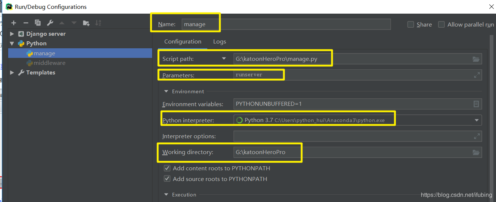

# django入门进阶05快捷复习手册
## 建立项目
django startproject projectname


## 启动服务
python manage.py runserver 9999#自己指定端口

python manage.py #使用默认8000端口


## 新增应用
python manage.py startapp blog#blog为应用名称

添加应用名到settings.py中的INSTALLED_APPS 里

```
INSTALLED_APPS = [
    ...
    'blog',
]
```

## 初始化数据表
执行 python manage.py makemigrations app名（可选）

再执行 python manage.py migrate

查看Django会自动在app/migreations/目录下生成移植文件

执行python manage.py sqlmigrate appname 文件id 查看sql语句,比如 python manage.py sqlmigrate blog 0001


## admin后台控制台生成
python manage.py createsuperuser


## 数据查询
```
article = models.Article.objects.get(pk=1)  
return render(request, 'blog/index.html', {'article': article})  

编辑 admin.py:
admin.site.register(models.Article)
def __str__(self):(python 3.X)
        return self.title
```

## 模板语言
```
<body>
<h1>{{article.title}}</h1>
<h3>{{article.content}}</h3>
</body>
  <a href="">{{article.title}}</a>
```

## url适配
```
url(r'^article/(?P<article_id>[0-9]+)$', views.article_page),
```

## debug调试



```

    {{ item }}, 


    {{ item }}, 

```

在for循环中还有很多有用的东西，如下：

```
变量	描述
forloop.counter	索引从 1 开始算
forloop.counter0	索引从 0 开始算
forloop.revcounter	索引从最大长度到 1
forloop.revcounter0	索引从最大长度到 0
forloop.first	当遍历的元素为第一项时为真
forloop.last	当遍历的元素为最后一项时为真
forloop.parentloop	
用在嵌套的 for 循环中，
```

获取上一层 for 循环的 forloop

```
<ul>

    <li>{{ athlete.name }}</li>

    <li>抱歉，列表为空</li>

</ul>

成绩优秀，自强学堂你没少去吧！学得不错

成绩良好

成绩一般

需要努力

不及格啊，大哥！多去自强学堂学习啊！

```

查看 Django queryset 执行的 SQL

```
print str(Author.objects.all().query)  
```

比如我们要获取作者的 name 和 qq

```
authors = Author.objects.values_list('name', 'qq')  
```

比如我们要获取作者的 name 和 qq

```
Author.objects.values('name', 'qq')  
Out[13]: <QuerySet [{'qq': u'336643078', 'name': u'WeizhongTu'}, {'qq': u'915792575', 'name': u'twz915'}, {'qq': u'353506297', 'name': u'wangdachui'}, {'qq': u'004466315', 'name': u'xiaoming'}]>
```

## 参考文献
https://blog.csdn.net/sinat_29214327/article/details/85226171

https://code.ziqiangxuetang.com/django/django-send-email.html

https://www.jianshu.com/p/116057746c64

